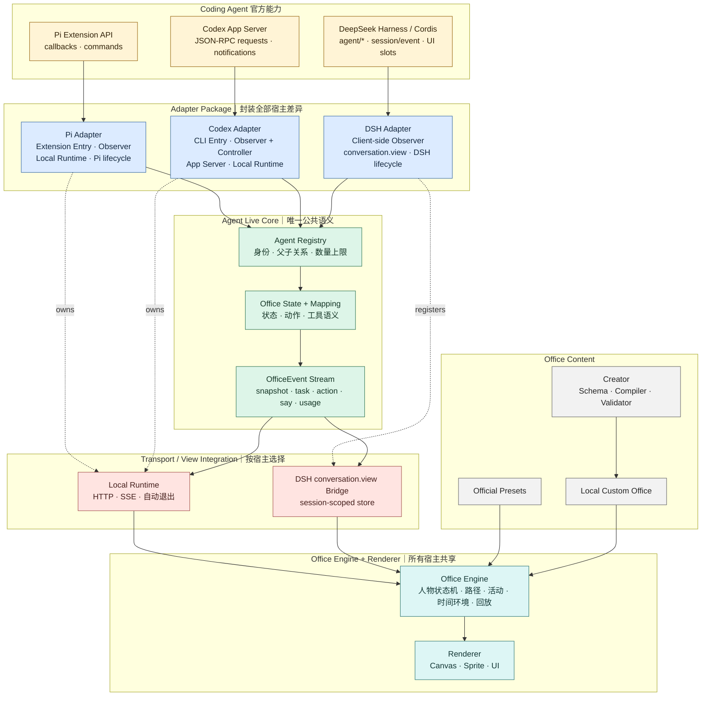

# Agent Live 架构

Agent Live 通过宿主专用 Adapter Package 接入 coding agent，再由公共 Engine 渲染办公室。Adapter Package 封装该宿主的安装入口、事件转换、正常生命周期和展示方式；Agent Live 公共代码只兜底清理 Engine/Runtime 自己启动或占用的资源。

## 统一架构



这张图中的三条宿主链路必须共享同一个 Core、Engine 和 Renderer，而不是分别建立三套业务模型。每个 Adapter Package 可以按照宿主要求选择完全不同的启动、关闭、控制和展示方式。

### 各层所有权

| 层 | 负责 | 不负责 |
| --- | --- | --- |
| Host | 官方事件、请求、UI 扩展点和持久化能力 | Agent Live 的业务语义 |
| Adapter Package | 安装入口、官方 payload 翻译、可选控制能力、正常生命周期和展示装配 | 定义公共办公室语义、NPC 行为和画法 |
| Core | Agent 身份、父子关系、状态、动作语义、容量规则和 OfficeEvent | 导入宿主 SDK、决定人物路线或画法 |
| Office Engine | 将 Core 事实和 Office Content 运行成办公室世界：人物状态机、路径、设施、NPC 日程、时间环境和回放 | 理解 Pi、Codex、DSH 原始事件；直接绘图 |
| Renderer | 绘制 Engine 计算出的世界状态和 UI | 业务规则、宿主连接和任务控制 |
| Runtime / View Bridge | 把 OfficeEvent 送到 Engine；由 Adapter 选择独立 Runtime 或宿主原生 View | 重新解释宿主事件或实现办公室规则 |
| Creator / Content | 声明式办公室内容的生成、校验、保存和选择 | 监听或控制 Agent Loop |

### Core

`plugins/agent-live/src/core/` 定义所有宿主共享的稳定语言：

- `protocol.ts`：Agent、Session、Action 和 OfficeEvent。
- `state.ts`：员工、任务、日志、用量和流式思考状态。
- `mapping.ts`：通用工具语义到办公室动作的映射。

Core 不得导入 Pi、Codex 或浏览器 UI。

### Engine

Engine 是 Agent Live 的办公室模拟层，回答“这个统一事实在办公室里如何发生”：

- 根据 Agent 状态选择工作、等待、交谈或空闲活动。
- 根据 Layout 的通道、目标点和障碍物规划人物移动。
- 分配可用设施，而不是把 Agent 数量与工位数量强绑定。
- 运行 NPC 班次、喝水、上厕所、聊天等生活事件。
- 驱动时间、天气、灯光和历史回放速度。

Engine 只消费 Core 的 `OfficeEvent` 和经过校验的 Office Content。它不能读取宿主 payload，也不能自行制造“工具执行成功”等工作事实。Renderer 只负责把 Engine 的世界状态画出来。

Engine 的宿主无关空间模型位于 `web/v2/office-engine.js`，负责导航、目标点、设施选择和环境查询；`environment-runtime.js` 负责时间、天气与班次。`app.js` 是浏览器 Scene Controller，消费 OfficeEvent、推进人物与生活活动并把世界状态交给 Renderer；`office-renderer.js` 和 `sprite-renderer.js` 只处理 Canvas 绘制。Engine 不包含宿主 SDK、HTTP/SSE 或 DSH View 代码。

### Runtime

`plugins/agent-live/src/runtime/` 管理一次 Agent Live 实例：

- `agent-live-runtime.ts`：统一持有 OfficeState、本地服务和清理流程。
- `server.ts`：仅监听 `127.0.0.1`，提供静态文件、SSE 和可选控制接口。

Runtime 是“独立浏览器 Viewer”这种展示形态的公共基础设施，不是所有 Adapter 的必经层。它不判断当前宿主；Pi、Codex Adapter Package 使用它，DSH 原生 View 不使用它。什么时候创建和关闭 Runtime 由对应 Adapter 决定。

`resource-guard.ts` 是 Runtime 的宿主无关内部兜底工具，不是一个架构层，也不对 Adapter 开放资源登记协议。它只清理 Agent Live 公共实现自己启动或占用的资源，例如本地 HTTP/SSE 服务、连接、定时器、内存事件记录以及未来可能使用的临时文件。Adapter、宿主和第三方插件创建的资源均由各自负责，公共 Guard 不介入。

### Adapter

`plugins/agent-live/src/adapters/` 中的每个目录都是完整的宿主集成包：

- `pi/`：Pi Extension 入口、Observer 事件转换、Local Runtime 和 Pi 退出策略。
- `codex/`：Codex App Server Client、事件转换、Controller、launcher 和 Local Runtime。
- `dsh/`：注册 `conversation.view`，观察 DSH Client 已提供的 Session / Conversation Snapshot 并直接转换为 OfficeEvent；详细设计见 [DSH-ADAPTER-DESIGN.md](DSH-ADAPTER-DESIGN.md)。

Adapter 自行决定是否管理 Runtime、宿主服务或原生 View，但不能直接控制坐标、NPC 或画法。公共 SDK 根据实际实现的控制方法推导可选能力，不再维护第二份手写布尔声明。接入新 coding agent 时，开发者只需新增一个 Adapter Package，不需要理解额外的 Integration 架构层。

Adapter 不增加中间的 `<Host>Fact` 公共层。官方事件已经是事实来源，直接映射到 Core 即可；只有某个宿主确实需要乱序关联或 payload 合并时，才在其 Adapter 内部增加私有 tracker，不能把它扩散为第二套公共协议。

同一个语义事实必须指定一个权威来源。例如 DSH 的 Agent 生命周期来自 `agent/*`，用户消息、工具调用、最终回答、用量和模型来自 `session/event`；`agent/assistant-stream` 只用于瞬时流式展示。不得同时消费 `tools/*` 和 `session/event` 来重复生成同一工具动作。这里所说的“去重”是宿主边界内的防御和关联，不是 Core 或所有 Adapter 都必须拥有的一层。

### Creator

Creator 将宿主模型产生的受约束 Office Seed / Patch 编译为本地 Custom Office。它不调用模型、不修改或重打包插件，也不新增 Runtime 能力。

当前实现分布为：

```text
content/schema.ts       Office Spec、Seed 与 Patch 合同
content/compiler.ts     Preset / Seed + Patch → 校验后的候选 Office
content/validator.ts    引用、容量、NPC、活动与环境校验
content/registry.ts     Official / Custom Office 注册、保存与选择
creator/service.ts      Patch 校验、原子保存与选择
creator/commands.ts     所有宿主共用的九个受限内部操作
creator/mode.ts         inactive / waiting / draft 模态状态合同
```

官方 Preset 随 Agent Live 发布；Custom Office 保存在用户本地。只有官方 Engine、Adapter 或组件能力升级时，用户才需要更新 GitHub 插件。

## 启动与选择

Adapter 和 Office 是两个独立选择：

```text
宿主插件入口 → 加载对应 Adapter Package
Office Registry → Custom Office 或 Official Preset
```

- Pi：Pi Adapter Package → Extension Observer + Local Runtime。
- Codex：Codex Adapter Package → App Server Controller + Local Runtime。
- DSH：Plugin Bundle → Client-side Observer + `conversation.view`，不启动额外 Runtime。
- 没有有效 Custom Office 时回退到官方 `tech-open-office`。

禁止通过扫描本机进程猜测 Adapter。

## 依赖规则

```text
core        → 不依赖其他业务层
runtime     → core
renderer    → protocol contract + content
adapter     → core + host API + optional runtime/view bridge
creator     → content schema + validator；不依赖 Adapter
```

审查新代码时，只要出现以下情况就应拒绝合并：

- Core 导入某个 coding agent SDK。
- Adapter 写入画面坐标或直接操作 Canvas。
- Preset 定义协议之外的新工作事件。
- Creator 通过生成任意代码绕过声明式 Schema。
- Custom Office 覆盖安装目录中的官方 Preset。

## 当前实现与迁移方向

三个 Adapter Package 已遵循同一边界：Pi 由 Extension 入口管理，Codex 的 `launcher.ts` 管理 App Server、Runtime 与 Viewer 策略，DSH 使用原生 View 生命周期。公共空间 Engine、Scene Controller 和 Renderer 已分文件，Adapter 不包含办公室坐标、NPC 或绘制规则。

| 能力 | Pi | Codex | DSH |
| --- | --- | --- | --- |
| 官方事实入口 | Extension callbacks | App Server notifications / requests | Client Session / Conversation Snapshot |
| Adapter 角色 | Observer | Observer + Controller | Observer |
| 正常生命周期策略 | Pi Adapter | Codex Adapter launcher | DSH Plugin / View lifecycle |
| 展示 | Local Runtime + Browser | Local Runtime + Browser | `conversation.view` 原生页面 |
| 控制入口 | 原宿主 UI | Agent Live Local Client | 原 DSH UI |

### 一句话辨别

| 模块 | 它回答的问题 |
| --- | --- |
| Adapter | 如何接入这个宿主，并把它报告的事实交给 Agent Live？ |
| Core | 这在 Agent Live 中是什么统一事实，是否合法？ |
| Engine | 这个事实在办公室世界中如何运行和表现？ |
| Renderer | 这个世界状态具体怎么画出来？ |
| Runtime | 独立网页需要怎样传输事件、服务资源并安全退出？ |

## 自定义体验

统一显式入口为 `/agent-live custom`，普通模式下不隐式解释为办公室编辑。支持动态上下文的宿主会把状态保持在当前会话内，直到 `/agent-live exit`、会话结束或插件卸载。宿主 Agent 调用 Creator 的受限操作生成 Patch；公共服务完成校验、原子保存和选择，失败时继续使用上一个有效 Office。Codex Skill 当前只保证调用当轮的显式自定义，不声称持续接管后续普通对话。

Pi 通过 `before_agent_start` 注入公共 Creator 状态；Codex 通过插件的 `UserPromptSubmit` Hook 注入同一合同。Hook 只负责保证模态状态和每轮可见提示，完整工作流仍在 Skill，实际数据修改仍在 Creator Command Router。未进入 Creator 时 Codex Hook 不输出任何上下文。

## 未来：Agent 日记

当前回放只在一次 Runtime 生命周期内保存带时间戳的标准事件，页面和本地服务退出后随内存一起清除。未来可在此基础上增加 **Agent Diary**：

- 按日期和 Agent 汇总任务、状态、工具动作、协作与结果。
- 使用 Codex/Pi 等宿主保存的会话历史作为任务事实来源。
- Agent Live 只持久化标准事件、办公室动作和回放时间线，不复制完整推理、原始工具输出或敏感消息正文。
- 支持从日记进入“某某的一天”跨会话回放，并允许用户查看、导出和删除本地记录。
- 默认完全本地保存，提供保留期限和关闭持久化的设置。

该能力属于 Runtime 的可选本地存储模块，不应进入 Adapter，也不应改变 OfficeEvent 的宿主无关语义。
