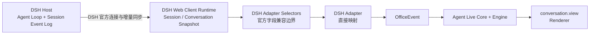

# DeepSeek Harness Adapter 设计

> 状态：第一阶段已实现，锁定并验证 DeepSeek Harness `0.1.5-rc.1`。DSH 仍处于 Developer Preview，升级时必须重新验证公开类型和运行时合同。

## 1. 目标与决定

第一阶段把 Agent Live 作为 DSH 会话中的原生 `conversation.view` 发布。用户仍在 DSH 原有界面创建任务、输入消息、停止任务和处理审批；切换到 **Agent Live** View 后，查看当前 Session 的办公室。

本阶段采用 **Client-side Observer**：读取 DSH 已经送达 Web Client 的 Session / Conversation Snapshot，把变化直接转换成公共 `OfficeEvent`，再交给 Agent Live Core、Engine 和 Renderer。

明确不做：

- 不启动 Agent Live HTTP、SSE 或额外浏览器页面。
- 不实现第二套输入框、任务 Controller 或审批 UI。
- 不增加 `DshFact`、Bridge Host 或 DSH 专用公共协议。
- 不读取 DSH 私有数据库或日志，不修改官方 UI 源码。
- 不额外复制完整 Session 历史。
- 不修改 DSH 的 Host→Client 事件 allowlist。

原因是 `conversation.view` 已提供 Session 范围的标准数据入口；而当前 DSH 的 `ctx.remote.$on()` 只接收官方 assembly 选择的固定 Host 事件，第三方插件不能稳定添加任意下行事件。第一阶段绕过这一限制会引入 DSH 补丁或额外本地服务，与产品的轻量原则冲突。

## 2. 用户体验

```text
安装并启用 DSH Plugin Bundle
        ↓
打开任意 DSH Session
        ↓
Chat | Agent Live | 其他 View
        ↓
切换到 Agent Live
        ↓
当前 Session 的 Agent、任务、工具动作和回答映射为办公室活动
```

- Chat 和 Agent Live 是同一个 Session 的两种 View，不创建新 Session。
- 用户在 Chat 中继续操作；Agent Live 只观察，不截获输入。
- View 切走后停止渲染和动画；Session 本身继续由 DSH 管理。
- 再次打开 View 时，从 DSH 当前 Snapshot 重建画面，而不是依赖旧组件仍存活。
- 第一阶段只展示当前 Session，不做跨 Session 总办公室。

## 3. 实际包内结构

对开发者而言它仍是一个 DSH Adapter Package，Host/Client 文件只是 DSH 官方构建方式要求的两个运行面，不是 Agent Live 新架构层。

```text
src/adapters/dsh/
└── adapter.ts          标准化 Snapshot 的增量游标与 OfficeEvent 映射

dsh/
├── cordis.patch.yml    DSH Bundle 注册
├── src/index.ts        空 Host 入口；不建立事件桥
├── src/client.tsx      Snapshot 选择、conversation.view 和生命周期
├── src/frame-runtime.ts 复用公共 Office Engine / Renderer
├── src/frame.html      View 内的隔离渲染文档
└── build.mjs           DSH lazy-CJS 客户端 bundle
```

另有 DSH Bundle 清单与 `cordis.patch.yml`，负责把 Host/Client 两个入口装入 DSH。共享的 Agent Live Core、Engine、Renderer 和 Content 不复制进 Adapter 业务代码。

DSH 版本字段只在 `dsh/src/client.tsx` 中读取；共享映射器只接受本地的窄结构。升级 DSH 时只需调整这一兼容入口并回归 Adapter，不让 DSH 类型进入 Core。

## 4. 数据流



DSH Client Runtime 已负责历史窗口合并和实时更新。Adapter 不再订阅第二条来源重复生成事件。`adapter.ts` 的增量游标只解决 OfficeEvent 投影本身的问题，例如：

- 哪些 `seq` 已经映射。
- `tool/call` 与 `tool/result` 的 `callId` 关联。
- 哪些已完成消息已经展示。
- View 重建时先发 `snapshot`，再只消费新增内容。

这些都是 DSH Adapter 私有实现，不进入 Core。

## 5. 官方数据到 OfficeEvent 的映射

映射只接受 DSH 正式 Snapshot/Session Event 中存在的字段。具体 TypeScript 字段名在实现前以锁定版本的导出类型为准。

| DSH 公开 Client 数据 | 权威用途 | Agent Live 输出 | 规则 |
| --- | --- | --- | --- |
| `useSession(...running)` 与 Session ID | 会话建立、运行/空闲 | `snapshot`、`session`、`agent_state` | View 首次挂载先建立完整状态；空闲以 Session lifecycle 为准 |
| `useProjection("modelSelection")` | 当前/最近模型 | `session` | 使用 `next ?? lastUsed`，只显示 DSH 明确提供的字段 |
| `useConversation(...views.get("chat"))` 的 user message | 当前用户任务 | `task` | 用公开节点 identity 生成稳定 key；文本限长 |
| Chat `runningCalls` 与 tool result | 工具开始与结果 | `action`、`action_end` | 使用 `callId` 成对映射；短工具可在一次 Snapshot diff 中补齐开始和结束 |
| Chat assistant 完成节点 | 回答与用量 | `say`、`usage` | 完整消息落定后显示；不展示私有 reasoning |
| Chat turn-error 节点 | Turn 异常 | `agent_state:error` | 只根据公开错误事实判断 |
| `subagentCatalog` + Session catalog/summary | 子 Agent 身份、父子关系、活动状态 | `agent_join`、`delegate`、`agent_leave` | inactive 只代表结束；公开数据无结果时省略 `agent_leave.ok` |

### 权威来源原则

- Conversation 与 model projection 负责消息、工具、结果、模型和用量。
- Session lifecycle snapshot 负责“是否仍在运行”。
- 同一消息或工具调用必须用稳定 key/callId 去重。
- 不同时订阅 Host `session/event` 和 Client Snapshot 来生成同一 OfficeEvent。
- 未识别的扩展事件忽略并记录调试信息；DSH 的 SessionEventMap 可扩展，代码不能用穷尽断言导致崩溃。

## 6. Agent 与 Subagent

主 Agent 使用当前 Session 的稳定 identity，不使用昵称作为 ID。

锁定版本通过 `subagentCatalog` projection 与 Session catalog/summary 同时提供稳定子 Session ID、父 Session 归属和 `running/inactive` 活动状态，因此本实现声明 `subagents: true`：

1. 子 Agent 的稳定 Session/Agent ID。
2. 父 Agent 或 ownership/address 关系。
3. 可判断加入与结束的生命周期信息。当前公开 activity 不提供结束结果，因此不会猜测成功或失败。

缺少任意一项，就先把能力声明为 `false`，不根据名称、消息内容或工具文本猜测。多人容量、工位不足及视觉避让由公共 Core/Engine 处理，不写进 DSH Adapter。

## 7. 实际接入边界

DSH 第一阶段实现的是官方 `conversation.view` 中的实时观察与渲染。它消费宿主已经提供的 Conversation、Session、模型、用量和 Subagent projection；不重复实现 prompt、interrupt、模型选择或审批控制面，用户继续使用 DSH 官方 UI。

项目不再维护一份手写的能力布尔描述符。公共 SDK 中的控制能力只由实际实现的方法推导；Subagent、模型与 Token 则是能够可靠取得时映射的宿主事实。

## 8. 生命周期和资源

DSH 负责：

- 加载和卸载 Cordis Plugin。
- 管理 Host、Session、Web Client 连接和历史同步。
- 自动移除属于 Plugin fiber 的 Slot 注册与订阅。

DSH Adapter 负责：

- 按 DSH 官方方式注册/注销 `conversation.view`。
- 在 View mount 时创建本 Session 的 Adapter cursor 与 Agent Live Engine 实例。
- 在 View unmount 时停止 Snapshot 订阅，并销毁该实例。

Agent Live 负责：

- 清理 Engine 自己创建的动画帧、定时器、临时回放记录和渲染资源。

第一阶段没有 Agent Live 本地端口、SSE、子进程或临时文件，因此关闭 View 不需要杀掉 DSH Host，也不存在遗留 Agent Live 服务。Adapter 不登记宿主资源到 Agent Live ResourceGuard。

## 9. 回放与历史

DSH 的持久化 Session Event 是任务事实来源。重新打开 View 时，Adapter 从 DSH 已装载的历史窗口构建当前 Office Snapshot；需要更早内容时，应使用 DSH 正式的 history/paging 能力，而不是扫描文件。

“某某的一天”动画仍需要 Agent Live 的轻量表现时间线，因为 DSH 历史描述的是任务事实，不包含人物走路、等待设施、NPC 活动等办公室表现。但这份时间线只保存映射后的 OfficeEvent/表现时间戳，不复制完整 prompt、reasoning 或工具输出。

## 10. 实现顺序与验收门

每一步完成后先通过本步和此前全部回归，再进入下一步：

1. **Bundle 骨架**：插件可安装、启用、卸载；无 Agent Live 本地端口或进程。
2. **原生 View（完成）**：`conversation.view` 注册 Agent Live，不创建新 Session。
3. **Snapshot 基线（完成）**：可重建主 Agent、模型、Turn 和空闲/运行状态。
4. **单 Turn 映射（完成）**：用户消息、完成回答、usage 和异常状态使用稳定 `seq` 去重。
5. **工具映射（完成）**：`tool/call`/`tool/result` 由同一 `callId` 成对显示，也处理一次渲染间完成的短工具。
6. **关闭与恢复（完成）**：View 卸载即销毁隔离文档、动画与内存 journal；重开从当前 Snapshot 重建。
7. **Subagent（完成）**：稳定子 Session ID、父子关系和活动状态来自官方 projections/catalog。
8. **性能门（完成）**：无额外服务和轮询；Renderer 仅随 View 存活，消息与参数在映射边界限长。

## 11. 暂缓的第二阶段

只有 DSH 提供稳定的第三方 Host→Client 事件注册能力，或我们决定维护自己的 DSH Client assembly 时，才考虑 Host-side Observer。届时仍遵循：

```text
DSH 官方 Host 事件 → DSH Adapter → OfficeEvent
```

不能增加另一套共享 Fact 层。若增加 Controller，也只是在 Adapter Package 内调用 DSH 正式 Remote API，并复用相同 Core/Engine；它不改变第一阶段 View Observer 的数据合同。
